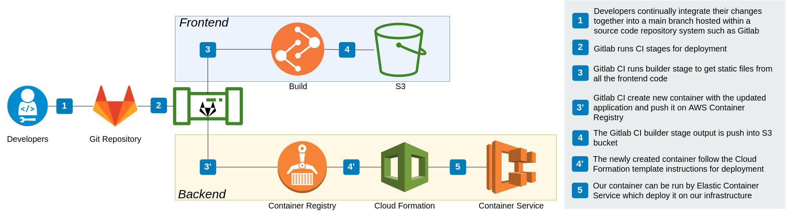
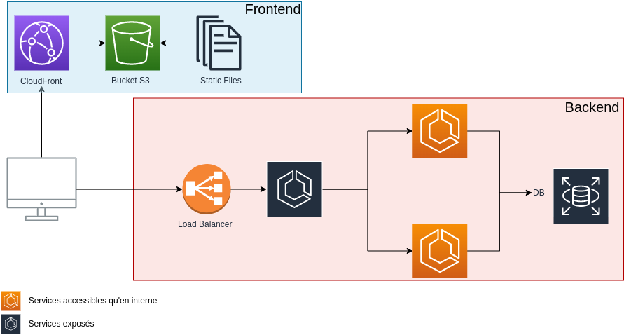

# My Little Shopping

All architecture for My Little Shopping

# Stack


### DESCRIPTION :

E-commerce web platform hosted on AWS cloud. Microservice achitecture managed by load balancer

### Pipeline :



### HOW TO :

#### Setup local env
      cp .env-example .env
      docker build back-end -t dev-mylittleshopping -f back-end/dev.dockerfile
##### Run project
      docker-compose up -d

##### Setup database (every time you delete the volumes or connect application to new database)
      docker-compose -f seeders.docker-compose.yml up

##### Open adminer
      go on http://localhost:8081 to manage mysql

#### Kill
   ##### All microservices
      docker-compose down
   ##### Specific microservice
      docker-compose stop front api database ...

### Deploy staging
      merge your code on branch master

### Deploy production
      git tag [version]
      git push --tags


# Cloud architecture :




# Mailer :


# File structure

```
my-little-shopping
 │
 ├── back-end
 │       ├── auth/
 │       │
 │       ├── db/
 │       │
 │       ├── gateway/ (exposed load balancer)
 │       │
 │       ├── mail/
 │       │
 │       ├── permissions/
 │       │
 │       └── web/
 │
 ├── front
 |
 └── ressources
```
